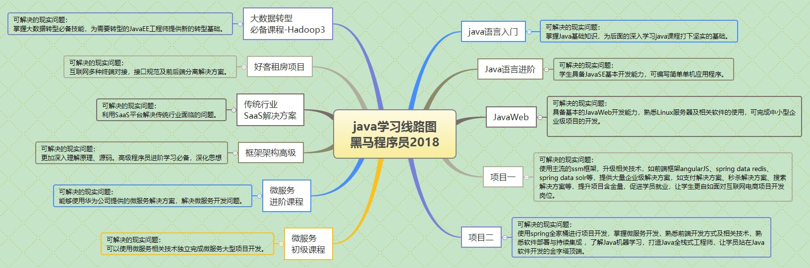
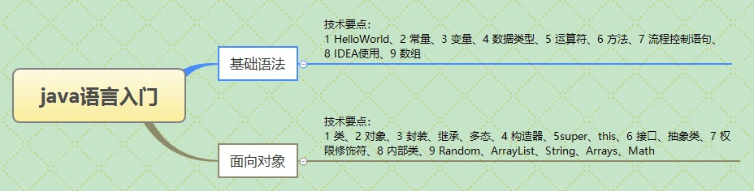
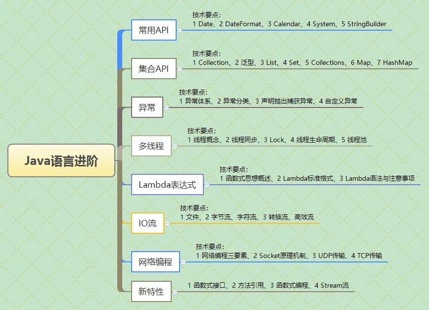
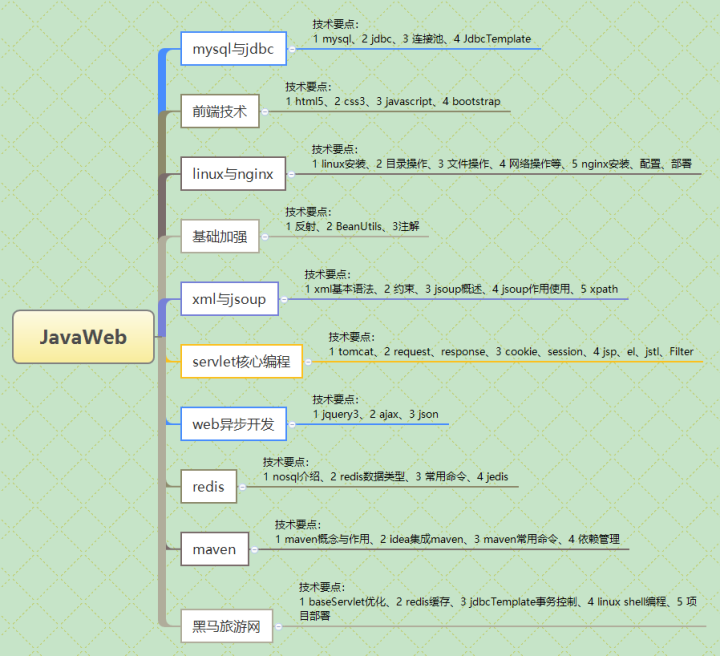

## 写在前面

**Java学习路线**



**Java入门**



需要掌握

- Java开发环境基本配置

- 运算符、表达式、流程控制语句、数组等使用

- 熟练使用IDEA开发工具

- 掌握面向对象思想

- 常用类String、ArrayList使用

**JAVA进阶**



需要掌握：

- 深入理解JAVA面向对象相关知识
- 掌握常用类：集合、IO流、时间日期等
- Java异常处理机制，熟悉Java多线程开发
- 网络基础知识，了解Socket原理，TCP、UDP协议
- 完成单机程序编写
- 数据Java新特性：Lambda、Stream等


**JavaWeb**



- 掌握Java JDBC、连接池操作、熟练操作mysql数据库
- 熟悉web开发中常识：HTML5、CSS3、JavaScript、BootStrap、jQuery等
- 掌握JavaWeb开发核心技术servlet、Listener、Filter等
- 熟悉linux服务器，安装常用开发软件Tomcat、MySQL、nginx等
- 掌握同步及异步操作的JavaWeb开发，具备B/S结构软件开发能力，完成基本的JavaWeb项目
- 熟悉基本的项目管理工具Maven使用

_______________________________

其他补充见[知乎](https://www.zhihu.com/question/297557447/answer/517445830)

## 1. 基础

### 1.1 copy

- clone

- 深度clone

###1.2 inter
	Java内部类是Java语言中很重要的一个概念，但是在实践中很少用到
	应用场景
-	1. 当某个类除了它的外部类，不再被其他的类使用时
      -2. 解决一些非面向对象的语句块
       -3. 一些多算法场合
       -4. 适当使用内部类，使得代码更加灵活和富有扩展性
###1.3 String
	1.“值传递”，即方法操作的是参数变量（也就是原型变量的一个值的拷贝）改变的也只是原型变量的一个拷贝而已，而非变量本身


```java
public class StringT {
    public static void main(String[] args) {
        String str = "123";
        change(str);
        System.out.println(str);// print "123"
    }

    public static void change(String str) {
        str = "456";
    }
}
```
	2. 对象含String做方法的参数传递
```java
/**
 * @author BYSocket
 * @since 2016-01-06 20:07:00
 * 对象含有String作为方法参数传递
 */
public class StringT2 {

    public static void main(String[] args) {
        StringObject sb = new StringObject();
        sb.setName("123");
        change(sb);
        System.out.println(sb.getName());//print "123"
    }

    public static void change(StringObject sb) {
        sb = new StringObject();
        sb.setName("456");
    }

}
class StringObject {
    String name;

    public String getName() {
        return name;
    }

    public void setName(String name) {
        this.name = name;
    }
}
```
##2. Collection
###2.1 hash
###2.2 list
###2.3 map
###2.4 queue
###2.5 set
###2.6 util